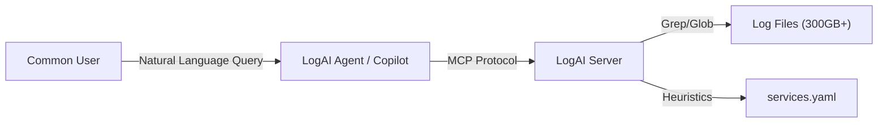

# LogAI

**LogAI** is an intelligent Model Context Protocol (MCP) server designed to investigate system logs at scale (300GB+/day). It allows users to query logs in natural language, retrieve relevant entries via optimized search, and receive export-grade insights.

## Architecture

LogAI is designed to run on your centralized Syslog Server. It acts as a bridge between your 300GB log volume and your AI tools (VSCode Copilot, IntelliJ Junie, or the included CLI Agent).



## Features
- **High-Performance Search**: Uses `grep` subprocesses and date-partitioned globbing to scan massive directories instantly.
- **Configurable Intelligence**: Define expert rules (e.g., "OOM" = Critical) in `config/services.yaml`.
- **Session Management**: Automatically saves retrieved logs and generated insights to `/tmp/logai/<uuid>/`.
- **Flexible Access**: use it via CLI or integrate it directly into your IDE.

---

## 1. Installation

1.  Clone/Copy this repository to your Ubuntu Syslog Server.
2.  Install `uv`: `curl -LsSf https://astral.sh/uv/install.sh | sh`
3.  Install dependencies:
    ```bash
    cd log_ai
    uv sync
    ```

## 2. CLI Usage (Terminal)

LogAI includes a built-in CLI Agent (`src/agent.py`) for terminal users.

### Quick Start
SSH into your server and run:
```bash
# Add alias to your .bashrc for convenience
alias logai="bash /path/to/log_ai/scripts/start.sh"

# Run it
logai
```

### Typical Session
*A typical interaction where a user investigates a web server error:*

```text
Welcome to LogAI. I can help you investigate system logs.
Try: 'find errors in aws-ecs-web' or 'check pylons-app status'

User> check pylons-app for OOM errors

LogAI: Searching logs for 'pylons-app' with term 'oom'...
LogAI: [Saved Logs] /tmp/logai/a1b2c3d4/logs/log-search-10-45.txt

LogAI: Analyzing for insights...
LogAI: [Insight] [CRITICAL] Recommendation: Check JVM/Python memory limits and scaling sizing.
LogAI: [Saved Insight] /tmp/logai/a1b2c3d4/insights/insight-10-45.txt

User> exit
# Session artifacts cleaned up.
```

---

## 3. IDE Integration (Remote Agent)

You can connect your local IDE's AI Assistant (Copilot, Junie) directly to the LogAI server over SSH. This allows you to ask questions about production logs without leaving your editor.

### VSCode (GitHub Copilot)
Add this to your MCP configuration (e.g., `claude_desktop_config.json`):

```json
{
  "mcpServers": {
    "log-ai-remote": {
      "command": "ssh",
      "args": [
        "user@syslog-server",
        "uv run --directory /path/to/log_ai src/server.py"
      ]
    }
  }
}
```

### IntelliJ (Junie / Amazon Q)
1.  Go to **Settings > Tools > Model Context Protocol**.
2.  Add a **Stdio Connection**:
    - **Command**: `ssh`
    - **Args**: `user@syslog-server "uv run --directory /path/to/log_ai src/server.py"`
3.  Ensure your SSH Agent is active for passwordless auth.

---

## Configuration

Services and Insight Rules are defined in `config/services.yaml`:

```yaml
services:
  - name: "pylons-app"
    path_pattern: "var_log/ecs/{YYYY}/{MM}/{DD}/web-server.log"
    insight_rules:
      - patterns: ["MemoryError", "OOM"]
        recommendation: "Check JVM/Python memory limits."
        severity: "critical"
```
