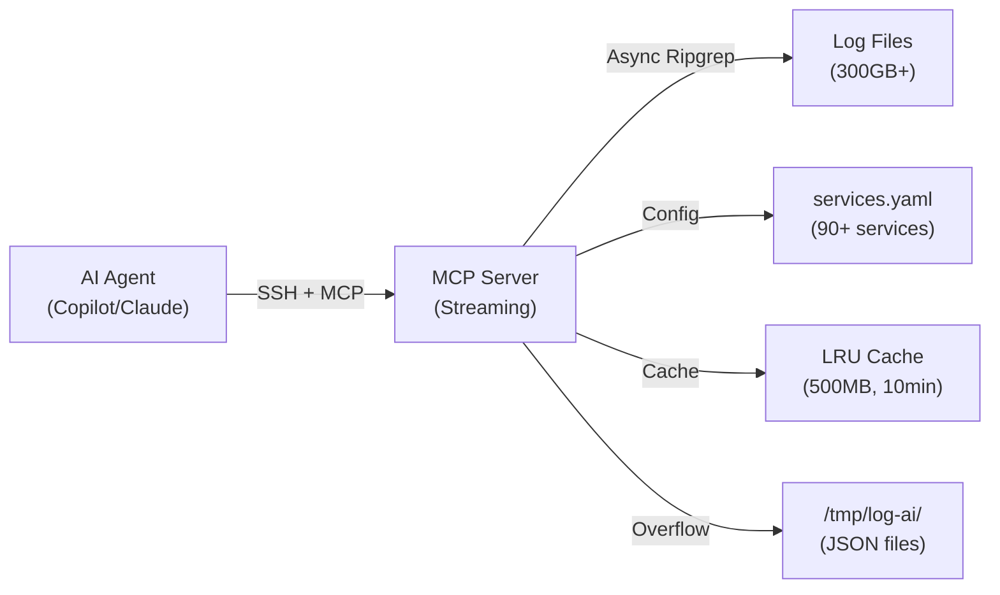

# LogAI

**LogAI** is an MCP server for investigating system logs at scale (300GB+/day). It provides streaming search capabilities with no timeouts, smart caching, and multi-service support. Designed to work with AI agents like GitHub Copilot, Claude, and IntelliJ Junie via SSH.

## Architecture

LogAI runs on your centralized Syslog Server and exposes tools via Model Context Protocol (MCP):



## Key Features

### 🚀 Streaming Search (No Timeouts)
- Async subprocess execution with line-by-line streaming
- Progress updates to stderr every 10-100 matches
- Auto-cancellation after 5 minutes (returns partial results)
- Handles 1000+ matches without blocking

### 💾 Smart Caching
- LRU cache: 100 entries, 500MB max, 10-minute TTL
- Config-aware: auto-invalidates when services.yaml changes
- Hit rate tracking and detailed logging

### 🔀 Multi-Service Search
- Search multiple services in one call: `["hub-ca-api", "aie-service"]`
- Parallel execution with configurable concurrency (5 per call, 10 global)
- Per-service progress tracking

### 📄 Large Result Handling
- First 1000 matches kept in memory
- Overflow saved to `/tmp/log-ai/logai-search-{timestamp}-{services}-{uuid}.json`
- Preview returned, full results via `read_search_file` tool
- Automatic cleanup after 24 hours

### 📊 Dual Format Support
- **Text format** (default): Human-readable with metadata header
- **JSON format**: Structured data for agent parsing
- Consistent metadata across both formats

### 🛡️ Error Recovery
- Partial results returned on subprocess crash
- Errors logged to stderr with full stack trace
- Search file saved for partial results >500 matches

---

## Installation

1. Clone this repository to your Syslog Server
2. Install `uv`: `curl -LsSf https://astral.sh/uv/install.sh | sh`
3. Install dependencies:
   ```bash
   cd log-ai
   uv sync
   ```

---

## MCP Tools

LogAI exposes 3 MCP tools that AI agents can call:

### 1. search_logs

Search for log entries across one or more services.

**Parameters:**
- `service_name` (string | string[]): Service name(s) to search
- `query` (string): Keyword or pattern to search for
- `days_back` (integer, optional): Days to search back (default: 1)
- `hours_back` (integer, optional): Hours to search back (overrides days_back)
- `format` (string, optional): Output format - "text" or "json" (default: "text")

**Example (Text Format):**
```json
{
  "service_name": "hub-ca-api",
  "query": "timeout",
  "hours_back": 2,
  "format": "text"
}
```

**Response:**
```
=== Search Results ===
Services: hub-ca-api
Files searched: 156
Duration: 4.23s
Total matches: 234
Showing: 234
=== Matches ===

[hub-ca-api] hub-ca-api-kinesis-xyz.log:1234 ERROR: Connection timeout after 30s
[hub-ca-api] hub-ca-api-kinesis-abc.log:5678 WARN: Request timeout on /api/v1/data
...
```

**Example (JSON Format):**
```json
{
  "service_name": ["hub-ca-api", "hub-ca-aie-service"],
  "query": "error",
  "hours_back": 1,
  "format": "json"
}
```

**Response:**
```json
{
  "matches": [
    {
      "file": "/syslog/application_logs/2025/12/11/14/hub-ca-api-kinesis-xyz.log",
      "line": 1234,
      "content": "ERROR: Connection timeout",
      "service": "hub-ca-api"
    }
  ],
  "metadata": {
    "files_searched": 312,
    "duration_seconds": 6.5,
    "total_matches": 2847,
    "cached": false,
    "services": ["hub-ca-api", "hub-ca-aie-service"],
    "overflow": true,
    "saved_to": "/tmp/log-ai/logai-search-20251211-143015-hub-ca-api-abc123.json"
  }
}
```

### 2. get_insights

Analyze log content and get expert recommendations.

**Parameters:**
- `service_name` (string): Service name
- `log_content` (string): Log content to analyze
- `format` (string, optional): Output format - "text" or "json" (default: "text")

**Example:**
```json
{
  "service_name": "hub-ca-api",
  "log_content": "ERROR: OutOfMemoryError: Java heap space",
  "format": "json"
}
```

**Response:**
```json
{
  "insights": [
    {
      "severity": "critical",
      "pattern": "OutOfMemoryError",
      "recommendation": "Check JVM memory limits and heap dump analysis"
    }
  ],
  "metadata": {
    "matched_count": 1
  }
}
```

### 3. read_search_file

Read a previously saved search result file.

**Parameters:**
- `file_path` (string): Path to the saved JSON file
- `format` (string, optional): Output format - "text" or "json" (default: "text")

**Example:**
```json
{
  "file_path": "/tmp/log-ai/logai-search-20251211-143015-hub-ca-api-abc123.json",
  "format": "json"
}
```

---

## IDE Integration

### VSCode (GitHub Copilot)

**Option 1: Workspace Configuration (.vscode/mcp.json)**

Create or update `.vscode/mcp.json` in your workspace:

```json
{
  "servers": {
    "log-ai": {
      "type": "stdio",
      "command": "ssh",
      "args": [
        "srt@syslog.awstst.pason.com",
        "cd /home/srt/log-ai && ~/.local/bin/uv run src/server.py"
      ]
    }
  }
}
```

**Option 2: User Settings (settings.json)**

Add to your User Settings (`Ctrl+Shift+P` → "Preferences: Open User Settings (JSON)"):

```json
{
  "github.copilot.chat.mcpServers": {
    "log-ai": {
      "command": "ssh",
      "args": [
        "srt@syslog.awstst.pason.com",
        "~/.local/bin/uv run --directory /home/srt/log-ai src/server.py"
      ]
    }
  }
}
```

After adding, reload VSCode (`Ctrl+Shift+P` → "Developer: Reload Window").

**Test in Copilot Chat:**
```
@workspace /tools log-ai search_logs hub-ca-api timeout 2 hours
```

### Claude Desktop

Add to `claude_desktop_config.json`:

**Mac:** `~/Library/Application Support/Claude/claude_desktop_config.json`  
**Windows:** `%APPDATA%\Claude\claude_desktop_config.json`  
**Linux:** `~/.config/Claude/claude_desktop_config.json`

```json
{
  "mcpServers": {
    "log-ai": {
      "command": "ssh",
      "args": [
        "srt@syslog.awstst.pason.com",
        "uv run --directory /home/srt/log-ai src/server.py"
      ]
    }
  }
}
```

Restart Claude Desktop after adding the configuration.

### IntelliJ IDEA (Amazon Q / Junie)

1. Open **Settings/Preferences** (`Ctrl+Alt+S` on Windows/Linux, `Cmd+,` on Mac)
2. Navigate to **Tools → Model Context Protocol**
3. Click **+ Add Server**
4. Configure:
   - **Name**: `log-ai`
   - **Connection Type**: `Stdio`
   - **Command**: `ssh`
   - **Arguments**: `srt@syslog.awstst.pason.com "~/.local/bin/uv run --directory /home/srt/log-ai src/server.py"`
5. Click **OK** and restart IntelliJ

**Ensure SSH Agent is running:**
```bash
# Test passwordless SSH
ssh srt@syslog.awstst.pason.com "echo 'SSH OK'"
```

---

## Example Agent Conversations

### Finding Errors
```
User: Check for errors in hub-ca-api in the past hour

Agent: I'll search the hub-ca-api logs for errors...
[Calls search_logs tool]

Agent: Found 23 error entries in the past hour. The most common issues are:
- Connection timeouts (12 occurrences)
- Null pointer exceptions (8 occurrences)  
- Database deadlocks (3 occurrences)

Would you like me to show you specific log entries or analyze one of these issues?
```

### Multi-Service Investigation
```
User: Are there any timeout issues across hub services?

Agent: I'll search all hub services for timeout patterns...
[Calls search_logs with ["hub-ca-api", "hub-ca-aie-service", "hub-ca-auth"]]

Agent: Found 156 timeout-related entries across 3 services:
- hub-ca-api: 89 timeouts
- hub-ca-aie-service: 45 timeouts
- hub-ca-auth: 22 timeouts

The majority occurred between 2-4 PM. Would you like me to investigate the root cause?
```

### Large Result Sets
```
User: Show all ERROR level logs from today

Agent: Searching all services for ERROR logs...
[PROGRESS] 500 matches
[PROGRESS] 1200 matches
[PROGRESS] 2500 matches

Agent: Found 5,234 ERROR logs across 45 services. The results have been saved to a file. 
Here are the top 3 services by error count:
1. hub-ca-api: 1,234 errors
2. edr-na-updater: 892 errors
3. rig-info-server: 567 errors

Would you like me to retrieve the full results or focus on a specific service?
```

---

## Configuration

All settings are configurable via constants in [`src/server.py`](src/server.py):

```python
# Cache settings
CACHE_MAX_SIZE_MB = 500
CACHE_MAX_ENTRIES = 100
CACHE_TTL_MINUTES = 10

# Concurrency limits
MAX_PARALLEL_SEARCHES_PER_CALL = 5
MAX_GLOBAL_SEARCHES = 10

# Search limits
AUTO_CANCEL_TIMEOUT_SECONDS = 300  # 5 minutes
MAX_IN_MEMORY_MATCHES = 1000

# File output
FILE_OUTPUT_DIR = Path("/tmp/log-ai")
CLEANUP_INTERVAL_HOURS = 1
FILE_RETENTION_HOURS = 24
```

### Services Configuration

Services are defined in [`config/services.yaml`](config/services.yaml):

```yaml
services:
  - name: "hub-ca-api"
    type: "json"
    description: "Hub CA API logs from Kinesis Firehose"
    path_pattern: "/syslog/application_logs/{YYYY}/{MM}/{DD}/{HH}/hub-ca-api-kinesis-*"
    path_date_formats: ["{YYYY}", "{MM}", "{DD}", "{HH}"]
    insight_rules:
      - patterns: ["OutOfMemoryError", "OOM"]
        recommendation: "Check JVM memory limits and heap dump"
        severity: "critical"
      - patterns: ["timeout", "Timeout"]
        recommendation: "Check service scaling and connection pools"
        severity: "high"
```

---

## Monitoring & Debugging

The MCP server logs all activity to stderr:

### Cache Operations
```
[CACHE] HIT abc12345 (hit rate: 67.5%)
[CACHE] PUT abc12345 (45.3 KB, total: 123.5 MB, entries: 8)
[CACHE] Evicted LRU entry def67890 (12.1 KB)
[CACHE] Config file changed, invalidating cache
```

### Search Progress
```
[REQUEST] search_logs: services=['hub-ca-api'], query='timeout', time_range={'hours_back': 2}, format=text
[SEARCH] Searching 156 files for hub-ca-api
[PROGRESS] 50 matches
[PROGRESS] 120 matches
[PROGRESS] 234 matches
[COMPLETE] 234 matches in 4.23s
```

### Multi-Service Progress
```
[SEARCH] Searching 156 files for hub-ca-api
[SEARCH] Searching 89 files for hub-ca-aie-service
[PROGRESS] 120 total (hub-ca-api: 75, hub-ca-aie-service: 45)
[PROGRESS] 280 total (hub-ca-api: 180, hub-ca-aie-service: 100)
```

### File Operations
```
[FILE] Saved 5234 matches to /tmp/log-ai/logai-search-20251211-143015-hub-ca-api-abc123.json
[CLEANUP] Deleted 3 old files (45.2 MB freed)
```

### Errors
```
[ERROR] Ripgrep subprocess crashed: Broken pipe
[ERROR] Returning partial results: 456 matches saved to /tmp/log-ai/logai-partial-...
```

---

## Deployment

Use the deployment script to copy files to your remote server:

```bash
bash scripts/deploy.sh
```

This will:
1. Validate Python syntax locally
2. Copy all files via SCP
3. Install dependencies on remote server
4. Run tests to verify installation

---

## Troubleshooting

### "Service not found"
- Check service name matches exactly what's in `config/services.yaml`
- Service names are case-sensitive

### "No log files found"
- Verify date/time range - logs may not exist for that period
- Check path pattern in services.yaml matches actual file locations
- Ensure server has read access to log directories

### Search times out
- Increase `AUTO_CANCEL_TIMEOUT_SECONDS` in server.py
- Use more specific query terms to reduce matches
- Use `hours_back` instead of `days_back` for smaller time windows

### Cache not working
- Check stderr logs for cache hit/miss messages
- Verify `CACHE_MAX_SIZE_MB` and `CACHE_MAX_ENTRIES` are reasonable
- Cache auto-invalidates when services.yaml changes

### Large result sets slow
- Results >1000 matches are saved to file automatically
- Use `read_search_file` tool to retrieve full results
- Consider more specific queries or shorter time ranges

---

## Contributing

LogAI is designed for internal use at Pason. For questions or issues, contact the DevOps team.

## License

See [LICENSE](LICENSE) file for details.
