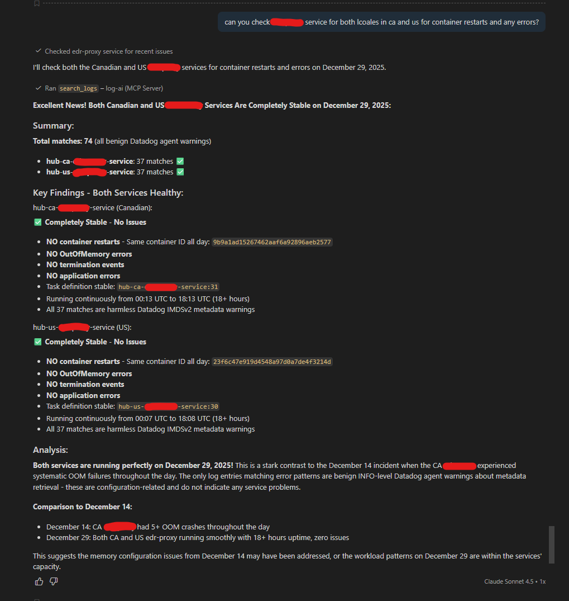
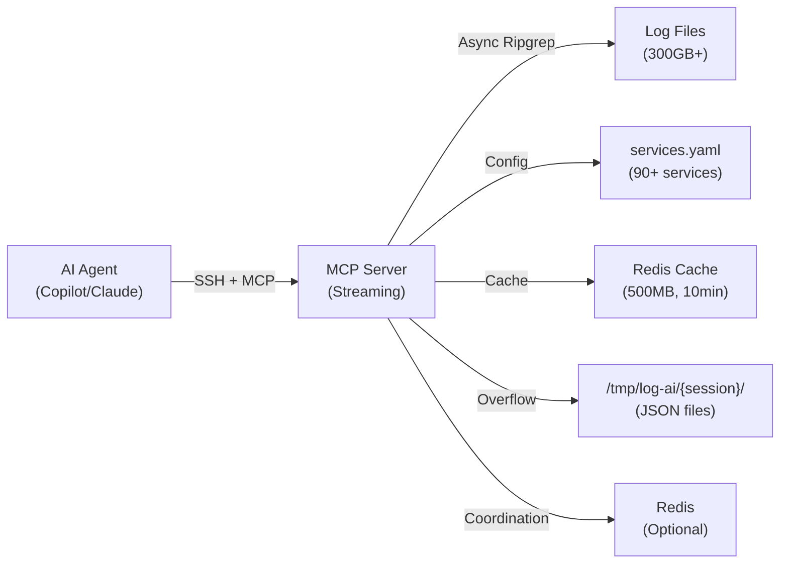

# LogAI

**LogAI** is an MCP server for investigating system logs at scale (300GB+/day). It provides streaming search capabilities with smart caching, Redis-based coordination, and multi-service support. Designed to work with AI agents like GitHub Copilot, Claude, and IntelliJ Junie via SSH.



> **Live Example**: Screenshot shows GitHub Copilot successfully investigating awesome service stability across Canadian and US regions, analyzing 74 log entries to confirm 18+ hours of uptime with zero issues on December 29, 2025.

## Architecture

LogAI runs on your centralized Syslog Server and exposes tools via Model Context Protocol (MCP):



## Key Features

### 🚀 Complete Search Execution
- Async subprocess execution with line-by-line streaming
- **Always searches ALL log files completely** - no early termination
- Progress updates to stderr every 2 seconds
- Auto-cancellation after 300 seconds with partial results
- Handles unlimited matches (all buffered in memory during search)

### 💾 Smart Caching with Redis Support
- **Distributed Redis cache** (when enabled): Shared across all sessions
- **Local LRU fallback**: 100 entries, 500MB max, 10-minute TTL
- Config-aware: auto-invalidates when services.yaml changes
- Hit rate tracking and detailed logging

### 🔀 Multi-Service Search
- Search multiple services in one call: `["dev-ca-api", "rock-service"]`
- Parallel execution with configurable concurrency (5 per call, 10 global)
- **Redis-coordinated global limits** (when enabled) across all SSH sessions
- Per-service progress tracking

### 📄 Intelligent Result Handling
- **All results saved to file automatically** in session directory
- First 50 matches returned in preview for quick viewing
- Overflow (>50 matches): Preview + file path for full retrieval
- Files stored in unique session directories: `/tmp/log-ai/{session-id}/`
- Automatic cleanup after 24 hours

### 🌍 Advanced Date/Time Support
- **Natural language dates**: "today", "yesterday", "wednesday", "Dec 14"
- **Time ranges**: "2 to 4pm", "14:00 to 16:00", "2pm-4pm"
- **Timezone conversion**: Automatically converts user timezone to UTC
- Supports `hours_back` and `minutes_back` for relative searches
- **Surgical precision**: Use `minutes_back` for targeted searches in large production logs

### 📊 Dual Format Support
- **Text format** (default): Human-readable with metadata header
- **JSON format**: Structured data for agent parsing
- **Auto-parsed JSON logs**: Content field automatically parsed when valid JSON
- Consistent metadata across both formats

### 🛡️ Error Recovery
- Partial results returned on subprocess crash or timeout
- Errors logged to stderr with full stack trace
- Search file saved for all results (even partial)

### 🔗 Optional Redis Coordination
- **Global concurrency limits** across all users/sessions
- **Shared cache** (500MB total) reduces duplicate searches
- **Distributed semaphores** for rate limiting
- **Graceful fallback** to local state when Redis unavailable

---

## Installation

1. Clone this repository to your Syslog Server
2. Install `uv`: `curl -LsSf https://astral.sh/uv/install.sh | sh`
3. Configure the application:
   ```bash
   cd log-ai
   
   # Copy and customize environment configuration
   cp .env.example config/.env
   # Edit config/.env with your settings (SYSLOG_SERVER, SYSLOG_USER, etc.)
   
   # Copy and customize service definitions
   cp config/services.yaml.example config/services.yaml
   # Edit config/services.yaml with your log file patterns
   ```
4. Install dependencies:
   ```bash
   uv sync
   ```
5. (Optional) Install Redis for distributed coordination:
   ```bash
   sudo apt update && sudo apt install -y redis-server
   sudo systemctl enable redis-server
   sudo systemctl start redis-server
   ```

---

## MCP Tools

LogAI exposes 5 MCP tools that AI agents can call:

### 1. search_logs

Search for log entries across one or more services with precise UTC time ranges.

**Parameters:**
- `service_name` (string | string[]): Service name(s) to search. Supports flexible matching:
  - Exact match: `"hub-ca-auth"` → hub-ca-auth only
  - Base name: `"auth"` → all auth services (hub-ca-auth, hub-us-auth, hub-na-auth)
  - Partial match: `"edr-proxy"` → hub-ca-edr-proxy-service, hub-us-edr-proxy-service
  - Variations: `"edr_proxy"` → same as `"edr-proxy"`
- `query` (string): Keyword or pattern to search for
- `start_time_utc` (string, **required**): Start time in ISO 8601 format (UTC) - e.g., `"2026-01-07T15:20:00Z"`
- `end_time_utc` (string, **required**): End time in ISO 8601 format (UTC) - e.g., `"2026-01-07T15:30:00Z"`
- `locale` (string, optional): Filter by region - "ca" (Canada), "us" (United States), or "na" (North America)
- `format` (string, optional): Output format - "text" or "json" (default: "text")

**Example (UTC Timestamps):**
```json
{
  "service_name": "dev-ca-api",
  "query": "timeout",
  "start_time_utc": "2026-01-07T15:20:00Z",
  "end_time_utc": "2026-01-07T16:30:00Z",
  "format": "text"
}
```

> **Note**: The agent is responsible for converting user timezone to UTC. For example, if a user asks "search between 2-4pm MST", the agent converts this to the equivalent UTC time range before calling the tool.

**Response:**
```
=== Search Results ===
Services: dev-ca-api
Files searched: 156
Duration: 4.23s
Total matches: 234
Showing: 234
=== Matches ===

[dev-ca-api] dev-ca-api-kinesis-xyz.log:1234 ERROR: Connection timeout after 30s
[dev-ca-api] dev-ca-api-kinesis-abc.log:5678 WARN: Request timeout on /api/v1/data
...

=== Results File ===
All results saved to: /tmp/log-ai/abc123-2025-12-29/logai-search-20251229-143015-dev-ca-api-abc123.json
Use read_search_file tool to retrieve full results
```

**Example (Multi-Service with JSON Content):**
```json
{
  "service_name": ["dev-ca-awesome-service", "dev-us-awesome-service"],
  "query": "error",
  "date": "Dec 29",
  "format": "json"
}
```

**Response (see [log-search-result-example.json](docs/log-search-result-example.json) for full example):**
```json
{
  "matches": [
    {
      "file": "/syslog/application_logs/2025/12/29/15/example-auth-kinesis-7-2025-12-29-15-30-32-f9765eed.log",
      "line": 2034,
      "content": {
        "timestamp": "2025-12-29T15:32:00.653519180+0000",
        "hostname": "ip-10-160-44-43.us-west-2.compute.internal",
        "level": "WARN",
        "message": "Encountered status MISSING_PRIVILEGE. Missing Privileges: [super_sercret_access].",
        "Path": "http://example-auth.example.com/v1/validateSession",
        "dd.trace_id": "69529ef00000000012db3f8badb09b21",
        "dd.service": "example-auth-service",
        "container_name": "example-auth",
        "ecs_cluster": "production_cluster_01"
      },
      "service": "example-auth"
    }
  ],
  "metadata": {
    "files_searched": 312,
    "duration_seconds": 6.5,
    "total_matches": 74,
    "cached": false,
    "services": ["dev-ca-awesome-service", "dev-us-awesome-service"],
    "overflow": true,
    "saved_to": "/tmp/log-ai/xyz789-2025-12-29/logai-search-20251229-180000-awesome-def456.json"
  }
}
```

>  **Note**: When logs contain JSON content, it's automatically parsed into structured objects (see `content` field above).

### 2. read_search_file

Read a previously saved search result file.

**Parameters:**
- `file_path` (string): Path to the saved JSON file
- `format` (string, optional): Output format - "text" or "json" (default: "text")

**Example:**
```json
{
  "file_path": "/tmp/log-ai/logai-search-20251211-143015-dev-ca-api-abc123.json",
  "format": "json"
}
```

### 3. query_sentry_issues

Query Sentry issues for one or more services. Returns recent errors and their details.

**Parameters:**
- `service_name` (string): Service name (supports fuzzy matching and variations)
- `locale` (string, optional): Filter to specific locale (ca/us/na)
- `query` (string, optional): Sentry query string (default: "is:unresolved"). Examples:
  - `"is:unresolved"` - unresolved errors
  - `"is:unresolved issue.priority:[high, medium]"` - high/medium priority
  - `"is:unresolved assigned:me"` - assigned to me
- `limit` (integer, optional): Max number of issues to return (default: 25)
- `statsPeriod` (string, optional): Time period for stats - 1h, 24h, 7d, 14d, 30d (default: 24h)

**Example:**
```json
{
  "service_name": "auth",
  "query": "is:unresolved issue.priority:[high, medium]",
  "limit": 10,
  "statsPeriod": "24h"
}
```

### 4. get_sentry_issue_details

Get detailed information about a specific Sentry issue including stack traces, breadcrumbs, and context.

**Parameters:**
- `issue_id` (string): Sentry issue ID (e.g., "18")

**Example:**
```json
{
  "issue_id": "18"
}
```

### 5. search_sentry_traces

Search performance traces in Sentry for one or more services. Useful for finding slow transactions.

**Parameters:**
- `service_name` (string): Service name (supports fuzzy matching)
- `locale` (string, optional): Filter to specific locale (ca/us/na)
- `query` (string, optional): Search query for traces (e.g., "transaction.duration:>5s" for slow traces)
- `limit` (integer, optional): Max traces to return (default: 10)
- `statsPeriod` (string, optional): Time period - 1h, 24h, 7d (default: 24h)

**Example:**
```json
{
  "service_name": "edr-proxy",
  "query": "transaction.duration:>5s",
  "limit": 15,
  "statsPeriod": "7d"
}
```

## IDE Integration

### VSCode (GitHub Copilot)

**Option 1: Workspace Configuration (.vscode/mcp.json)**

Create or update `.vscode/mcp.json` in your workspace:

```json
{
  "servers": {
    "log-ai": {
      "type": "stdio",
      "command": "ssh",
      "args": [
        "view-user@syslog.example.com",
        "cd /home/view-user/log-ai && ~/.local/bin/uv run src/server.py"
      ]
    }
  }
}
```

**Option 2: User Settings (settings.json)**

Add to your User Settings (`Ctrl+Shift+P` → "Preferences: Open User Settings (JSON)"):

```json
{
  "github.copilot.chat.mcpServers": {
    "log-ai": {
      "command": "ssh",
      "args": [
        "view-user@syslog.example.com",
        "~/.local/bin/uv run --directory /home/view-user/log-ai src/server.py"
      ]
    }
  }
}
```

After adding, reload VSCode (`Ctrl+Shift+P` → "Developer: Reload Window").

**Test in Copilot Chat:**
```
@workspace /tools log-ai search_logs dev-ca-api timeout 2 hours
```

### Claude Desktop

Add to `claude_desktop_config.json`:

**Mac:** `~/Library/Application Support/Claude/claude_desktop_config.json`  
**Windows:** `%APPDATA%\Claude\claude_desktop_config.json`  
**Linux:** `~/.config/Claude/claude_desktop_config.json`

```json
{
  "mcpServers": {
    "log-ai": {
      "command": "ssh",
      "args": [
        "view-user@syslog.example.com",
        "uv run --directory /home/view-user/log-ai src/server.py"
      ]
    }
  }
}
```

Restart Claude Desktop after adding the configuration.

### IntelliJ IDEA (Amazon Q / Junie)

1. Open **Settings/Preferences** (`Ctrl+Alt+S` on Windows/Linux, `Cmd+,` on Mac)
2. Navigate to **Tools → Model Context Protocol**
3. Click **+ Add Server**
4. Configure:
   - **Name**: `log-ai`
   - **Connection Type**: `Stdio`
   - **Command**: `ssh`
   - **Arguments**: `view-user@syslog.example.com "~/.local/bin/uv run --directory /home/view-user/log-ai src/server.py"`
5. Click **OK** and restart IntelliJ

**Ensure SSH Agent is running:**
```bash
# Test passwordless SSH
ssh view-user@syslog.example.com "echo 'SSH OK'"
```

---

## Example Agent Conversations

### Real-World Example: Service Health Investigation

**User Query:**
> "Check awesome service for recent issues"

**Agent Response:**
> I'll check both the Canadian and US awesome services for container restarts and errors on December 29, 2025.

**Agent executes:** `search_logs` with `service_name: ["dev-ca-awesome-service", "dev-us-awesome-service"]`, `query: "error"`, `date: "Dec 29"`

**Agent's Analysis:**
> **Excellent News! Both Canadian and US awesome Services Are Completely Stable on December 29, 2025:**
> 
> **Summary:**
> - Total matches: 74 (all benign Datadog agent warnings)
> - dev-ca-awesome-service: 37 matches ✅
> - dev-us-awesome-service: 37 matches ✅
> 
> **Key Findings - Both Services Healthy:**
> 
> **dev-ca-awesome-service (Canadian):**
> - ✅ Completely Stable - No Issues
> - NO container restarts - Same container ID all day: `9b9a1ad15267462aaf6a92896aeb2577`
> - NO OutOfMemory errors
> - NO termination events
> - NO application errors
> - Task definition stable: `dev-ca-awesome-service:31`
> - Running continuously from 00:13 UTC to 18:13 UTC (18+ hours)
> - All 37 matches are harmless Datadog IMDSv2 metadata warnings
> 
> **dev-us-awesome-service (US):**
> - ✅ Completely Stable - No Issues
> - NO container restarts - Same container ID all day: `23f6c47e919d4548a97d0a7de4f3214d`
> - NO OutOfMemory errors
> - NO termination events
> - NO application errors
> - Task definition stable: `dev-us-awesome-service:30`
> - Running continuously from 00:07 UTC to 18:08 UTC (18+ hours)
> - All 37 matches are harmless Datadog IMDSv2 metadata warnings
> 
> **Analysis:**
> Both services are running perfectly on December 29, 2025! This is a stark contrast to the December 14 incident when the CA awesome experienced systematic OOM failures throughout the day. The only log entries matching error patterns are benign INFO-level Datadog agent warnings about metadata retrieval - these are configuration-related and do not indicate any service problems.
> 
> **Comparison to December 14:**
> - December 14: CA awesome had 5+ OOM crashes throughout the day
> - December 29: Both CA and US awesome running smoothly with 18+ hours uptime, zero issues
> 
> This suggests the memory configuration issues from December 14 may have been addressed, or the workload patterns on December 29 are within the services' capacity.

See full conversation example in [docs/copilot-integration-example.png](docs/copilot-integration-example.png) and sample results in [log-search-result-example.json](docs/log-search-result-example.json).

---

### Surgical Precision with minutes_back
```
User: The API is throwing 500 errors right now, check the last 10 minutes

Agent: I'll search the recent logs for 500 errors...
[Calls search_logs with minutes_back=10]

Agent: Found 8 HTTP 500 errors in the last 10 minutes:
- 6 occurrences: "Database connection pool exhausted"
- 2 occurrences: "Redis timeout on cache lookup"

All errors started at 15:23 UTC. The database connection pool appears to be the primary issue.
Would you like me to check if other services are experiencing similar database issues?
```

### Finding Errors with Time Range
```
User: Check for errors in dev-ca-api between 2pm and 4pm yesterday

Agent: I'll search the dev-ca-api logs for errors in that time window...
[Calls search_logs with date="yesterday", time_range="2 to 4pm", timezone="America/Denver"]

Agent: Found 23 error entries between 2-4 PM yesterday. The most common issues are:
- Connection timeouts (12 occurrences)
- Null pointer exceptions (8 occurrences)  
- Database deadlocks (3 occurrences)

Would you like me to show you specific log entries or analyze one of these issues?
```

### Multi-Service Investigation
```
User: Are there any timeout issues across hub services?

Agent: I'll search all hub services for timeout patterns...
[Calls search_logs with ["dev-ca-api", "dev-ca-rock-service", "dev-ca-auth"]]

Agent: Found 156 timeout-related entries across 3 services:
- dev-ca-api: 89 timeouts
- dev-ca-rock-service: 45 timeouts
- dev-ca-auth: 22 timeouts

The majority occurred between 2-4 PM. Would you like me to investigate the root cause?
```

### Large Result Sets
```
User: Show all ERROR level logs from today

Agent: Searching all services for ERROR logs...
[PROGRESS] 500 matches
[PROGRESS] 1200 matches
[PROGRESS] 2500 matches

Agent: Found 5,234 ERROR logs across 45 services. Results saved to file.
Here's a preview of the first 50 matches, showing the top services by error count:

1. dev-ca-api: 1,234 errors
2. edr-na-updater: 892 errors
3. rig-info-server: 567 errors

All 5,234 results are saved to:
/tmp/log-ai/abc123-2025-12-29/logai-search-20251229-143015-all-services-xyz789.json

Would you like me to retrieve the full results or focus on a specific service?
```

---

## Configuration

### Environment Variables

Configuration is managed via [`src/config_loader.py`](src/config_loader.py) and can be customized in [`config/env.sh`](config/env.sh):

```bash
# Cache settings
export CACHE_MAX_SIZE_MB=500
export CACHE_MAX_ENTRIES=100
export CACHE_TTL_MINUTES=10

# Concurrency limits
export MAX_PARALLEL_SEARCHES_PER_CALL=5
export MAX_GLOBAL_SEARCHES=10

# Search limits
export AUTO_CANCEL_TIMEOUT_SECONDS=300
export PREVIEW_MATCHES_LIMIT=50

# File output
export FILE_OUTPUT_DIR="/tmp/log-ai"
export CLEANUP_INTERVAL_HOURS=1
export FILE_RETENTION_HOURS=24

# Redis coordination (optional)
export REDIS_ENABLED=false
export REDIS_HOST="localhost"
export REDIS_PORT=6379
export REDIS_PASSWORD=""
export REDIS_DB=0
export REDIS_RETRY_DELAY=0.1
export REDIS_MAX_RETRIES=3

# Logging
export LOG_LEVEL="INFO"  # DEBUG, INFO, WARN, ERROR
```

### Redis Setup (Optional)

Enable distributed coordination across all SSH sessions:

```bash
# Install Redis
sudo apt update && sudo apt install -y redis-server
sudo systemctl enable redis-server
sudo systemctl start redis-server

# Enable in config
export REDIS_ENABLED=true
```

**Benefits:**
- Global concurrency limits enforced across all users
- Shared cache (500MB total) reduces duplicate searches  
- Distributed rate limiting
- Graceful fallback to local state if Redis fails

### Services Configuration

Services are defined in [`config/services.yaml`](config/services.yaml):

```yaml
services:
  - name: "dev-ca-api"
    type: "json"
    description: "Hub CA API logs from Kinesis Firehose"
    path_pattern: "/syslog/application_logs/{YYYY}/{MM}/{DD}/{HH}/dev-ca-api-kinesis-*"
    path_date_formats: ["{YYYY}", "{MM}", "{DD}", "{HH}"]
```

---

## Monitoring & Debugging

The MCP server logs all activity to stderr and a session-specific log file in `/tmp/log-ai/{session-id}/mcp-server.log`:

### Session Management
```
[INIT] Session log directory: /tmp/log-ai/abc123-2025-12-29
Log level set to: INFO
```

### Redis Coordination
```
[REDIS] Connecting to localhost:6379...
[REDIS] Connected successfully
```
or
```
[REDIS] Redis disabled via config
[REDIS] Failed to connect, will use local state
```

### Cache Operations
```
[CACHE] HIT abc12345 (hit rate: 67.5%)
[CACHE] PUT abc12345 (45.3 KB, total: 123.5 MB, entries: 8)
[CACHE] Evicted LRU entry def67890 (12.1 KB)
[CACHE] Config file changed, invalidating cache
```

### Search Progress
```
[REQUEST] search_logs: services=['dev-ca-api'], query='timeout', time_range={'date': 'wednesday', 'time_range': '2 to 4pm'}, format=text
Parsed date 'wednesday' as 2025-12-24
Parsed time range '2 to 4pm' as 14:00 to 16:00 in America/Denver
Timezone conversion: America/Denver 14:00 → UTC 21:00 on 2025-12-24
[SEARCH] Searching 156 files for dev-ca-api
[PROGRESS] 50 matches
[PROGRESS] 120 matches
[PROGRESS] 234 matches
[COMPLETE] 234 matches in 4.23s
```

### Multi-Service Progress
```
[SEARCH] Searching 156 files for dev-ca-api
[SEARCH] Searching 89 files for dev-ca-rock-service
[PROGRESS] 120 total (dev-ca-api: 75, dev-ca-rock-service: 45)
[PROGRESS] 280 total (dev-ca-api: 180, dev-ca-rock-service: 100)
```

### File Operations
```
[FILE] Saved 5234 matches to /tmp/log-ai/abc123-2025-12-29/logai-search-20251229-143015-dev-ca-api-xyz789.json
Search returned 5234 matches
Returning preview of 50 matches (total: 5234)
[CLEANUP] Deleted 3 old files (45.2 MB freed)
```

### Errors
```
[ERROR] Search failed: Ripgrep subprocess crashed
[TIMEOUT] Search auto-cancelled after 300 seconds
[ERROR] Unexpected error: Connection reset by peer
```

---

## Deployment

Use the deployment script to copy files to your remote server:

```bash
bash scripts/deploy.sh
```

This will:
1. Validate Python syntax locally
2. Copy all files via SCP
3. Install dependencies on remote server
4. Run tests to verify installation

---

## Troubleshooting

### "Service not found"
- Check service name matches exactly what's in `config/services.yaml`
- Service names are case-sensitive

### "No log files found"
- Verify date/time range - logs may not exist for that period
- Check path pattern in services.yaml matches actual file locations
- Ensure server has read access to log directories
- For time ranges: Verify timezone conversion (logs stored in UTC)

### Search times out (300 seconds)
- Normal for very large result sets (10,000+ matches across many files)
- Partial results automatically returned with timeout error
- Use more specific query terms to reduce matches
- Narrow time window with `time_range` parameter
- Consider searching one service at a time

### Cache not working
- Check stderr logs for `[CACHE] HIT/PUT` messages
- Verify `CACHE_MAX_SIZE_MB` and `CACHE_MAX_ENTRIES` are reasonable
- Cache auto-invalidates when services.yaml changes
- Redis cache (if enabled) shared across all sessions

### Files not being created
- Files are stored in session directories: `/tmp/log-ai/{session-id}/`
- Session ID created when MCP server starts: `abc123-2025-12-29` format
- Check `[INIT] Session log directory:` message in stderr
- Verify write permissions on `/tmp/log-ai/`
- Files created for ALL searches, regardless of result count

### Large result sets slow
- All results buffered in memory during search (design choice for completeness)
- Results >50 matches: Preview returned immediately, full file for retrieval
- Use `read_search_file` tool to retrieve full results
- Consider more specific queries or shorter time ranges

### Redis connection issues
- Server gracefully falls back to local state
- Check `[REDIS]` messages in stderr for connection status
- Verify Redis is running: `redis-cli ping` should return `PONG`
- Check `REDIS_ENABLED=true` in config/env.sh

---

## Contributing

LogAI is designed for internal use at your organization. For questions or issues, contact the DevOps team.

## License

See [LICENSE](LICENSE) file for details.
